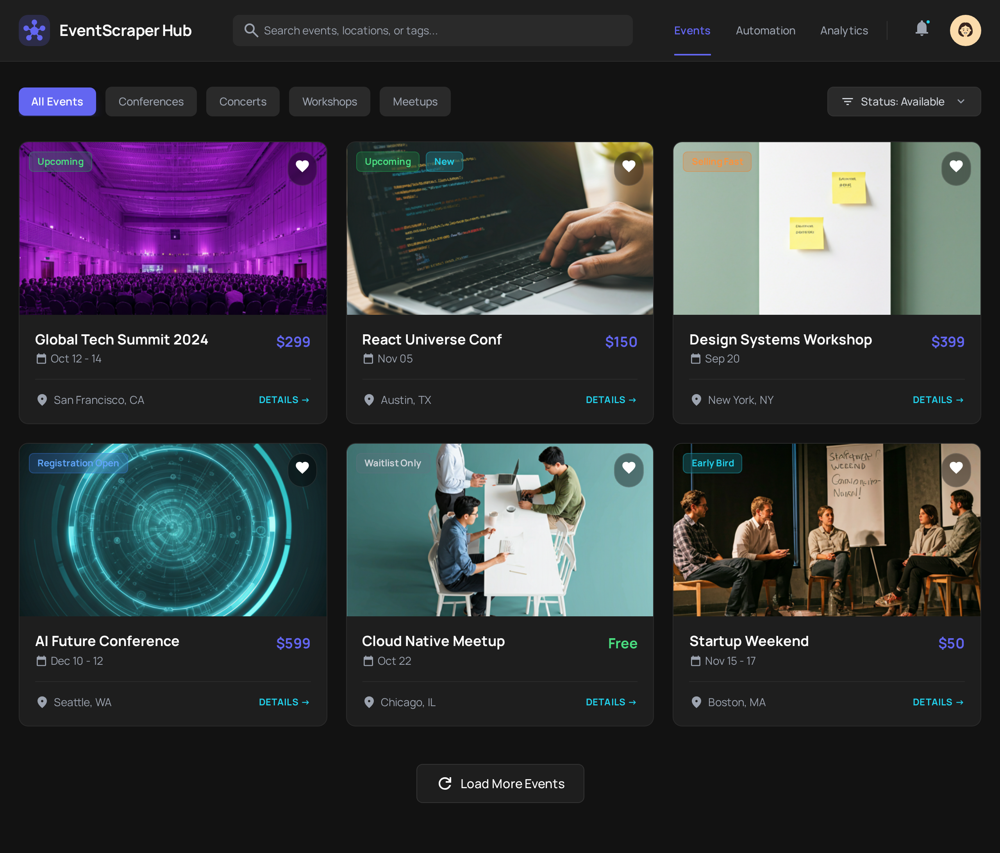
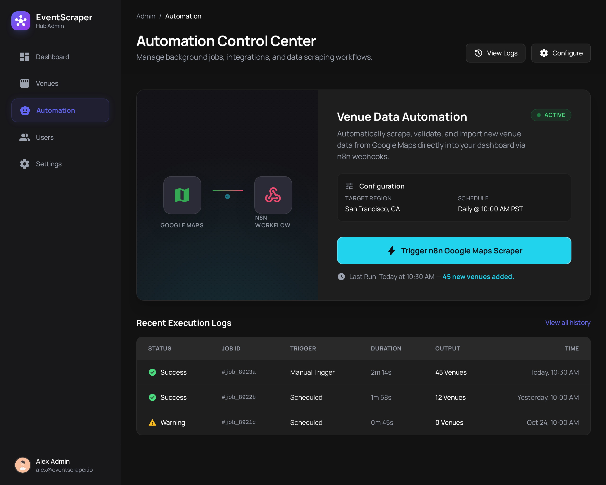

# 🚀 EventScraper Hub - Project Report
**Created by:** Abdellah Alioua

---

## 📖 Introduction
**EventScraper Hub** is a web application designed to help people discover, organize, and manage events easily. 

Imagine you want to find a tech conference or a music concert. Usually, you have to search on Google, copy the details, and save them in a note. My application does all of this in one place. It allows users to create their own events, save their favorites, and even uses a "robot" (automation) to find venues automatically.

---

## 💡 What Can Users Do? (Use Cases)
This diagram shows the main actions a user can take in the application.

*   **Visitors** can view events.
*   **Registered Users** can create events, add them to favorites, and trigger the automation tool.

*(Drag and drop `stitch_event_discovery_dashboard/use case.png` here)*

---

## 🏗️ How It Is Built (Structure)
To make the application work, we need to organize our data (Users, Events, Favorites). This diagram shows how different parts of the system connect to each other.

*(Drag and drop `stitch_event_discovery_dashboard/class digrame.png` here)*

---

## 📱 The Application Interface
Here is what the application looks like when you use it. I focused on a clean, modern design that is easy to navigate.

### 1. The Dashboard (Home Page)
This is where users see all upcoming events. They can filter by category (Conference, Concert, etc.) or search for specific names.

*(Drag and drop `stitch_event_discovery_dashboard/event_discovery_dashboard/screen.png` here)*

### 2. Event Details
When you click on an event, you see all the important information: date, location, price, and description.

*(Drag and drop `stitch_event_discovery_dashboard/Details →/screen.png` here)*

### 3. Automation Panel
This is the special feature of the app. A user types a **City** (e.g., "Paris") and a **Keyword** (e.g., "Coworking Space"), and the system automatically finds places for them.

*(Drag and drop `stitch_event_discovery_dashboard/admin/automation_panel/screen.png` here)*

---

## 🤖 The "Magic" Behind the Scenes (Automation)
One of the coolest features is the **Automation Workflow**. I used a tool called **n8n**.

**How it works:**
1.  The User asks for "Pizza places" in "New York".
2.  My app sends this request to **n8n**.
3.  **n8n** searches Google Maps automatically.
4.  It saves the results into a **Google Sheet** and sends them back to my database.

It turns a manual search process into a one-click action!

*(Drag and drop `stitch_event_discovery_dashboard/Sequence Triggering Scraping Workflow.svg` here)*

---

## 🛠️ Technologies Used
I used modern tools to build this project:

*   **Frontend (The Face):** HTML, CSS, JavaScript. I used "Tailwind CSS principles" to make it look beautiful.
*   **Backend (The Brain):** Node.js & Express. It handles all the logic (logging in, saving data).
*   **Database (The Memory):** PostgreSQL (Supabase). This is where all users and events are safely stored.
*   **Deployment (The Host):** Vercel. It puts the website online so anyone can access it.
*   **Automation (The Helper):** n8n. It connects my app to Google services.

---

## ✅ Conclusion
**EventScraper Hub** is more than just a list of events. It is a full platform that combines standard web features (like logging in and creating posts) with advanced automation. It solves the problem of spending too much time searching for event venues manually.
