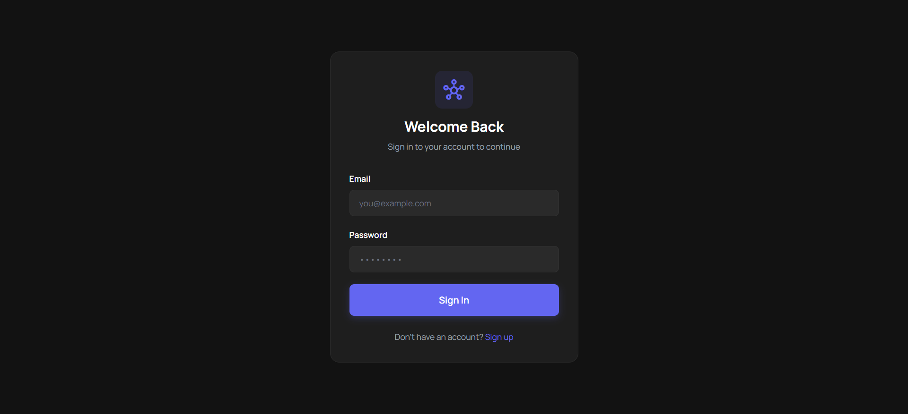
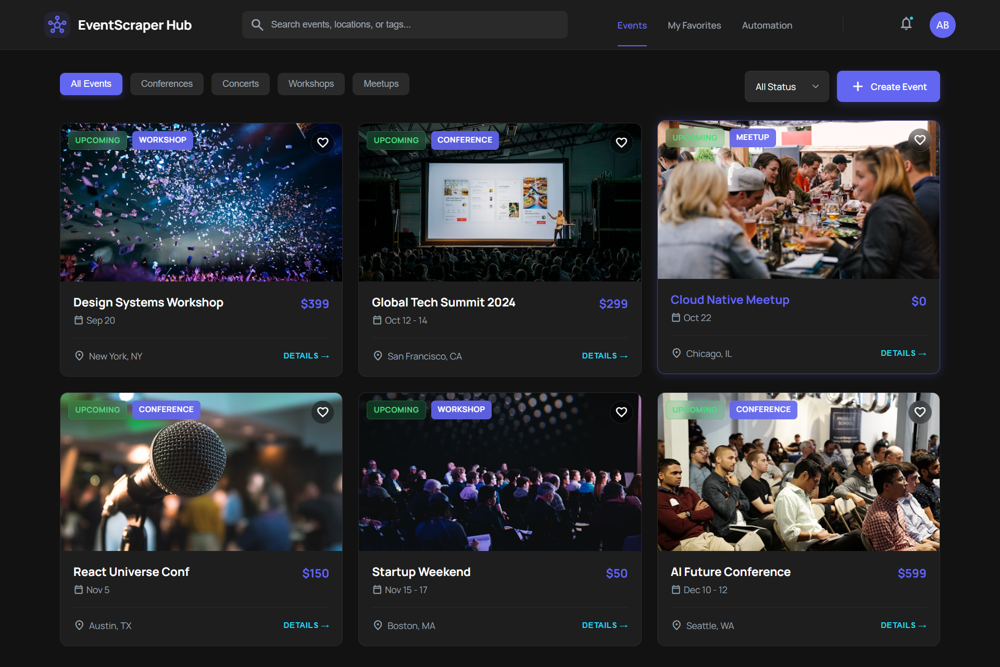
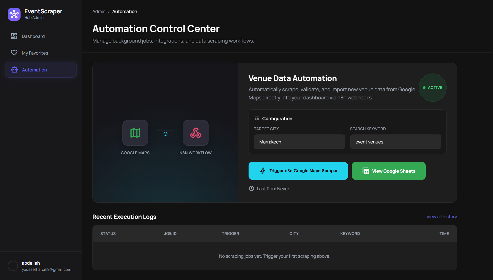

# 📋 Project Report: EventScraper Hub

---

**Student Name:** Abdellah Alioua  
**Project:** Event Management Web Application

---

## 🎯 What is this project?

I created a **website** that helps people find and manage events like conferences, concerts, and meetups.

**The main idea is simple:**
- Users can see all events in one place
- Users can create their own events  
- Users can save events they like (favorites)
- The app can automatically search Google Maps to find places

---

## 👥 Who can use the app and what can they do?

This picture shows what different users can do:

**Simple explanation:**
- **Visitors** (people not logged in): They can only look at events
- **Logged-in users**: They can create events, save favorites, and use the automatic search tool

---

## 🗂️ How the data is organized

This picture shows how I store information in the app:

**What I store:**
- **Users**: Name, email, password
- **Events**: Title, description, date, location, image
- **Favorites**: Which user saved which event

---

## 📸 How the app looks

### 1. Login Page
This is where users enter their email and password to access their account.

---

### 2. Sign Up Page
New users can create an account here by entering their information.

---

### 3. Home Page (Events List)
This is the main page. Users see all events here. They can search and filter by category.

---

### 4. Event Details Page
When you click on an event, you see all the information about it.

---

### 5. Create New Event
Logged-in users can create new events using this form.

---

### 6. My Saved Events
Users can save events they like and see them all in one place.

---

### 7. Automation Page
This is the special feature! Users type a city and a keyword, and the app searches Google Maps automatically.

---

## 🤖 How the automation works

I used a tool called **n8n** to create an automatic workflow. Here is how it works:

**Step by step:**
1. User types a city (example: "Casablanca") and a keyword (example: "Restaurant")
2. My app sends this to **n8n** (the automation tool)
3. **n8n** searches Google Maps
4. The results go to a **Google Sheet** and also to my database
5. The user sees the results on the screen

**Why is this useful?**
Instead of searching Google Maps manually and copying information one by one, users just click one button and get all results automatically!

---

## 🛠️ What tools I used

| Part | Tool | Why I used it |
|------|------|---------------|
| **Frontend** (what users see) | HTML, CSS, JavaScript | To create the website pages |
| **Backend** (the logic) | Node.js with Hono | To handle login, database, and all actions |
| **Database** (to store data) | PostgreSQL (Supabase) | To save users, events, and favorites |
| **Hosting** (to put online) | Vercel | So anyone can access the website |
| **Automation** | n8n | To connect with Google Maps automatically |

---

## ✅ What I learned

- How to build a complete website (frontend + backend)
- How to use a database to store information
- How to create user login and security
- How to automate tasks with n8n
- How to deploy a website online

---

## 📝 Conclusion

**EventScraper Hub** is not just a simple website. It combines:
- User management (login, register)
- Event management (create, view, save)
- Smart automation (automatic Google Maps search)

This project shows that I can build a real, working web application from start to finish.

---

**Thank you for reading!**

*Created by Abdellah Alioua*
